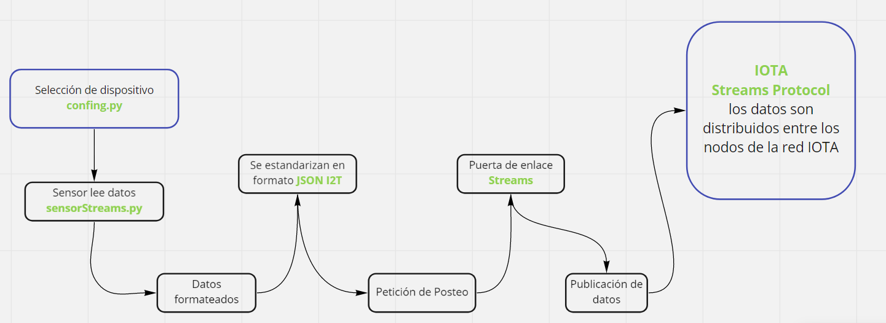

# P.o.C. Raspie to Tangle.

## Propósito
Desarrollar un script en lenguaje python que sea versátil y fácil de configurar para soportar varios dispositivos de sensado a partir de una computadora de placa reducida [Raspberry Pi](https://es.wikipedia.org/wiki/Raspberry_Pi) y transaccionar los datos a la red Tangle de [IOTA](https://es.wikipedia.org/wiki/IOTA_(protocolo)).





### Hardware necesario
- Raspberry pi zero w
- Protoboard
- Conversor MCP3008
- Sensores:
  - DHT11: Temperatura y humedad.
  - MQ135: Sensor ambiental de gases.
  - BMP180: Sensor barométrico.


### Descripción:

1) **Configuración de Raspberry pi zero W:**
     - [Remota usando Wifi](https://desertbot.io/blog/headless-pi-zero-w-wifi-setup-windows).
     - [Usando interfaz gráfica via USB](https://www.circuitbasics.com/access-raspberry-pi-desktop-remote-connection/).
2) **Configuración de cableado de sensores:** correspondiente como se encuentra en las instrucciones de la carpeta [Wiring](https://vassgit.vass.es/root/iot2tangle_raspberry/-/tree/master/http/Wiring).
- Configuración de entorno python de trabajo.
  - [Python Wiki](https://vassgit.vass.es/root/CROSS-ARCH_iota_poc/-/wikis/python).
- Utilizaremos un **Gateway [HTTP](https://github.com/iot2tangle/Streams-http-gateway)** para transaccionar datos a la Tangle de IOTA.
- Dentro del directorio **http** existe un archivo **config.py**, en él indicar el ID del dispositivo y seleccionar con un **1** el sensor determinado a utilizar, y con **0** los restantes, seleccionamos el intervalo de relé y definimos el endpoint a donde queremos apuntar el sensado.
- Ejemplo:
  
````
# Device name
device_id = 'DHT11'

# Select sensors to use 1 = use | 0 = skip
dht11 = 1
bmp180 = 0
mq135 = 0
enviromental = 0
gyroscope = 0
accelerometer = 0
magnetometer = 0


# Select relay interval
relay = 30

# Define endpoint
endpoint = 'http://127.0.0.1:8080/sensor_data'

````


- Posteriormente ejecutamos `python sensorStreams.py`.
- En una terminal aparte ejecutamos el **[Gateway](https://github.com/iot2tangle/Streams-http-gateway)** que nos conectará a la Tangle.
- Para concer el ID del canal por el cual estemos transmitiendo, en una terminal ejecutamos `curl --location --request GET '0.0.0.0:8080/current_channel?DEVICE_ID_1'` en donde **DEVICE_ID_1** es el ID de nuestros dispositivo.
- Podemos explorar la información enviada a la Tangle añadiendo nuestro ID del canal en el explorador de [IoT2Tangle](https://explorer.iot2tangle.io/).